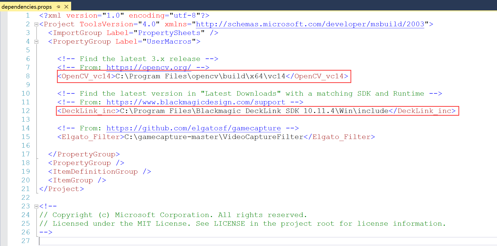
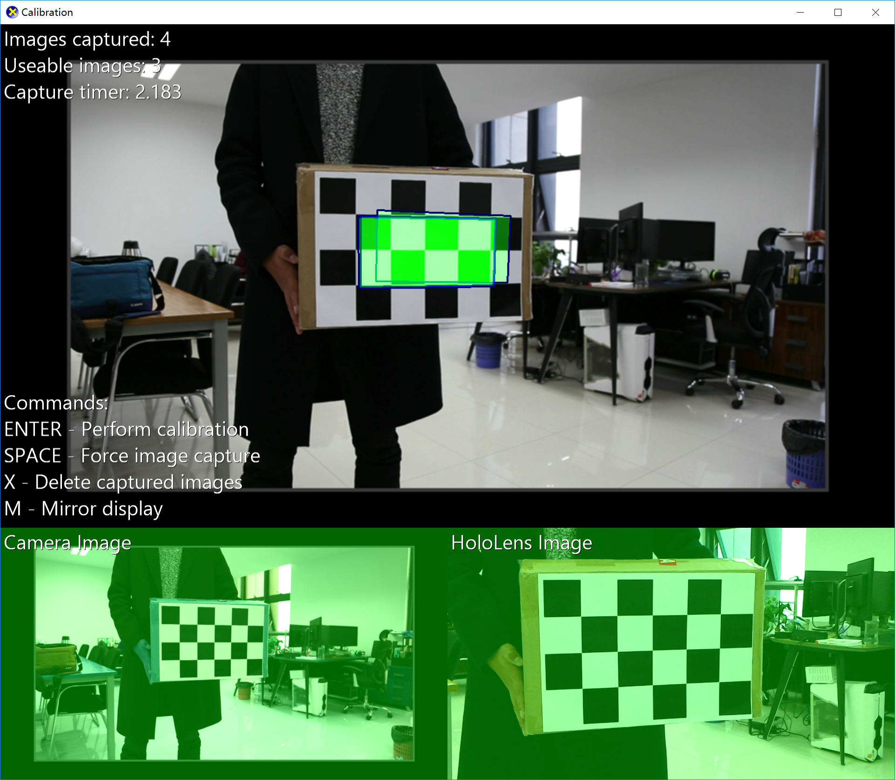
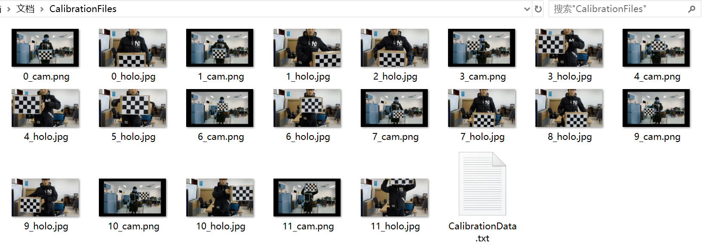
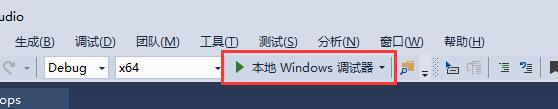

# Calibration

## 一、 相机设置

1. 调整相机的焦距到一个合适值，在校准开始和完成后不要再改变焦距。
2. 将相机切换到全手动模式，通过增加相机的快门速度和减少光圈的大小，确保图像清晰且在运动中不会模糊。
3. 调整相机 ISO，使画面变亮，注意不要带来太多噪点。

## 二、程序设置

运行 `Calibration.sln`，修改 *dependencies.props* 文件下的 OpenCV 路径和 DeckLink 路径为你安装的路径。



使用 A3 纸横向打印 *Dependencies/CalibrationPatterns* 目录下的 `2_66_grid_FULL.png` 棋盘文件。为了方便测试，请将其固定在一个平面（硬纸盒或其他）上。

在项目中打开并修改 `stdafx.h`文件：

（1）方格宽度，默认是0.0677米，如果打印出来的宽度不一致，修改： 

```c#
#define CHESS_SQUARE_SIZE 0.0677 // Width of the chess squares in meters = 2.66 inches.
```

（2）根据实际打印的棋盘图像，修改棋盘上X，Y轴方格数目

```c#
#define GRID_CELLS_X 6 // Number of columns in the chess board.
#define GRID_CELLS_Y 4 // Number of rows in the chess board.
```

（3）修改 Hololens 用户名和密码（因为我们使用 USB 连接，如果你要使用 Wifi 连接，还需要修改IP和端口）：

```c#
#define HOLOLENS_USER L"user"
#define HOLOLENS_PW L"password"
```

默认情况下校准程序运行在1920 * 1080 分辨率下，如果要修改分辨率，打开并修改`CompositorConstants.h`文件：

```c#
// Frame Dimensions and buffer lengths
//TODO: change this to match video dimensions from your camera.
#define FRAME_WIDTH    1920
#define FRAME_HEIGHT   1080
```

## 三、校准

请以 **Debug x64** 模式运行程序，首先会将旧的校准文件移动到 *My Documents/OldCalibrationFiles/* 下，本次校准文件会被放在 *My Documents/CalibrationFiles* 文件下。

呈下、左、右、上方向以S型移动棋盘，当棋盘移动到相机无法看到的位置时，后退一步，重复执行，如下图所示：


>1. 不要旋转棋盘相对于相机超过90°，否则校准系统可能无法正常工作。
>2. 不要将相机对准浅色的墙壁，因为OpenCV在这种背景下检测棋盘图案较困难，应用程序可能会耗尽内存。

如果一切设置正确，相机将会自动开始拍照。



完成后按下 *Enter* 键停止校准并生成校准结果，拍摄的图片被存放在 *My Documents/CalibrationFiles*目录下：



打开 *CalibrationData.txt* 文件查看校准结果，下面是一个示例：

```properties
# Copyright (c) Microsoft Corporation. All rights reserved.
# Licensed under the MIT License. See LICENSE in the project root for license information.
# Stereo RMS calibration error (Lower numbers are better)
RMS: 44.5421
# DSLR RMS calibration error (Lower numbers are better)
DSLR RMS: 0.203851
# HoloLens RMS calibration error (Lower numbers are better)
HoloLens RMS: 0.34048
# Delta in meters of Hololens from Camera:
Translation: -0.00211806, -0.0910024, 0.00956102
# Row Major Matrix3x3 (This should be close to identity)
Rotation: 0.999703, -0.0181576, -0.0162388, 0.0187252, 0.999194, 0.0355101, 0.0155809, -0.0358036, 0.999237
# Field of View of DSLR:
DSLR_fov: 75.9442, 47.5184
# Field of View of HoloLens:
Holo_fov: 47.7189, 27.9294
# DSLR distortion coefficients:
DSLR_distortion: -0.130447, 0.0715056, -0.00174504, -0.000724455, -0.00542177
# DSLR camera Matrix: fx, fy, cx, cy:
DSLR_camera_Matrix: 901.984, 899.587, 705.553, 378.074
```

1. `RMS` 值越接近于 0 校准效果越好。（如果RMS值过大，查看 *My Documents/CalibrationFiles/* 下生成的照片，确保相机和 Hololens 相对应的照片在不同方向和距离上都有用来校准的完整的棋盘的图像。)
2. 确保 `DSLR RMS` 和 `HoloLens RMS` 值接近于0。由于两个相机的尺寸和焦距不同，立体校准可能会不准确。

---

RMS（均方根），将所有值平方求和，求其均值，再开平方，就得到均方根值。
$$
X_{RMS} 
= \sqrt{\frac{{\sum_{i=1}^n{X_i}^2}}{n}} 
= \sqrt{\frac{{X_1}^2+{X_2}^2+\cdots+{X_n}^2}{n}}
$$

## 四、Q & A

（1）运行程序时启动失败或者拍摄照片后程序崩溃？

答：请将模式切换到 **Debug x 64** ，点击 `本地 Windows 调试器`来运行程序，而不是使用 `ctrl + F5`来执行。

