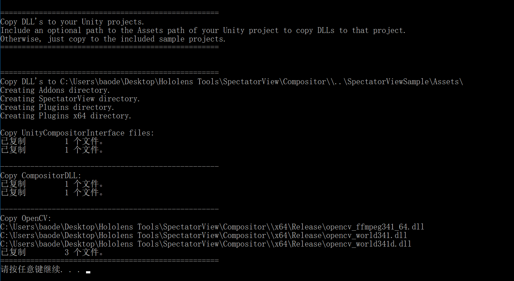

# Compositor

## 一、程序设置

运行 `Compositor.sln`，修改 *dependencies.props* 文件下的 `OpenCV` 路径和 `DeckLink` 路径。

默认情况下程序运行在 1920 * 1080 分辨率下，如果需要更改为其他分辨率：

1. 打开 SharedHeaders 项目下的 *CompositorConstants.h* 文件，修改 `FRAME_WIDTH` 和 `FRAME_HEIGHT` 的值。

   ```c#
   // Frame Dimensions and buffer lengths
   //TODO: change this to match video dimensions from your camera.
   #define FRAME_WIDTH    1920
   #define FRAME_HEIGHT   1080
   ```

2. DeckLinkManager 会根据你的框架尺寸来找到合适的分辨率，如果你的框架尺寸没有被选中，修改 DeckLinkManager.cpp 中的 StartCapture() 方法。

## 二、执行程序

1. 完成修改后，将程序构建为 `Release x64`。
2. 执行目录下的 `CopyDLL.cmd`，该脚本会自动将所需依赖复制到指定的 Unity 项目中（如果不指定Unity项目，默认情况下复制到 *SpectatorViewSample* 项目中）。



## 三、 Q & A

（1）执行 CopyDLL.cmd 时提示找不到路径？

使用 CMD 打开控制台，通过指定目录的方式生成，例如：

```
CopyDLL.cmd D:\test
```

此时在 test 目录下会得到一个 `Addons` 目录，将其复制到 *SpectatorViewSample* 项目的 `Assets`下即可。