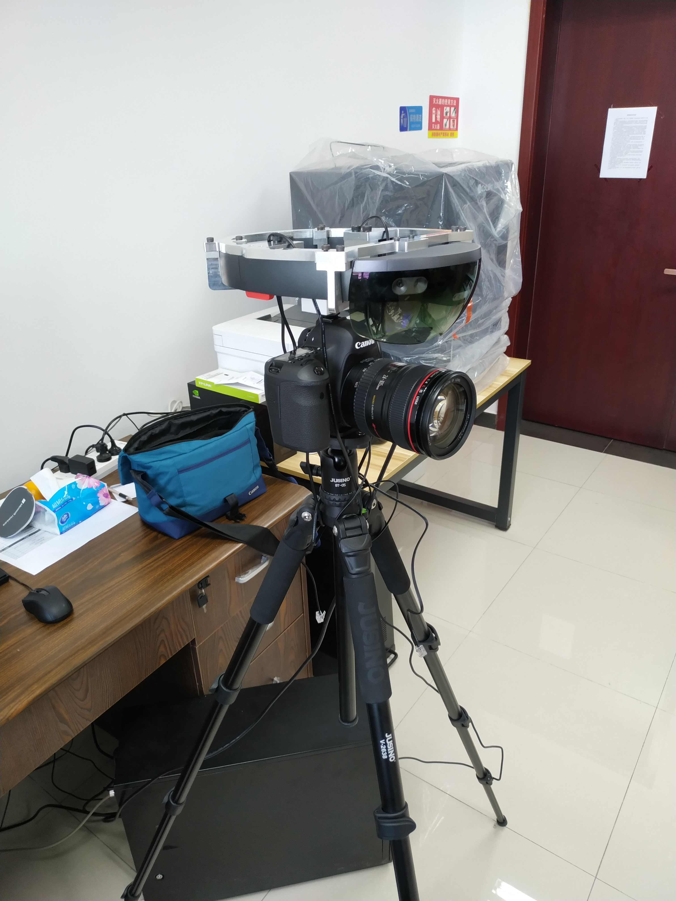

# 软、硬件环境搭建

## 一、硬件搭建

### 1.1 Hololens Mount

`Hololens Mount` 用于将 Hololens 固定起来，你有以下几种方法来得到它：

**（1）使用官方提供的 3D 模板自行打印**

模型文件我已经提供在 *Dependencies/Hololens_Mount* 目录下。但是我并不推荐使用这种方式，原因如下：

1. 3D 打印机并不是十分普及，且每一个零部件打印时间较长。
2. 如果你是使用 FDM 3D 打印机，受限于精度，打印出来的模型螺丝孔可能并不能匹配。
3. 如果你是采用塑料材质打印，受限于材料，不够稳固，容易折断。
4. 官方模板存在精度误差，需要对其修改后打印，需要用户具有建模知识。

下图是我们使用 FDM 3D打印机的样子，使用的 PLA 材料：

**（2）自行购买** 

JD上有卖整个搭建解决方案的卖家，搜索 **Hololens** 就能看到了，但是一般需要预定。

**（3）使用其他替代方案**

Hololens Mount 的作用就是方便将 Hololens 和相机固定住，因此只要能固定住就 OK 了。在文章：https://blog.csdn.net/lyx_zhl/article/details/56011636中为我们提供了一种解决思路，如下图：

### 1.2 Hotshoe

如果你使用到了 Hololens Mount，那么 `Hotshoe` 是必须的。Hotshoe 帮助你将 Hololens Mount 和相机固定在一起。

如果你使用的是官方推荐的 [Canon EOS 5D Mark III](https://www.amazon.com/Canon-Frame-Full-HD-Digital-Camera/dp/B007FGYZFI/ref=sr_1_3?s=photo&ie=UTF8&qid=1480537693&sr=1-3&keywords=Canon+5D+Mark+III)相机，或者我锁使用的 Canon EOS 6D(W) 相机，那么 Hotshoe 的尺寸为 **1/4 inch**，Taobao、Amaze均有销售，搜索 **hotshoe** 即可。

使用 T7 螺丝刀将 Hololens 内部的头撑去除掉，然后按照下图的方式，将相机、Hotshoe、Hololens Mount组装起来：

具体的组装视频可以参考：[HoloLens Spectator View Bracket Assembly - YouTube](https://www.youtube.com/watch?v=PHF5TlyDg5M)

## 二、软件搭建

请确保系统为 `Win10 1709+` ，通过 `设置 -> 系统 -> 关于` 可以查看。

在主机上安装好 Blackmagic Design Intensity Pro 4K 视频采集卡，然后安装软件：

- `Blackmagic_DeckLink_SDK_10.11.4.zip`
- `Blackmagic_Desktop_Video_Windows_10.11.4.zip`
- `opencv-3.4.1` 

## 三、测试连接

1. 将相机架在三角架上。
2. 使用 MINI HDMI -> HDMI 线将相机和视频采集卡的输入口连接。
3. 使用 USB 连接 Hololens 和 主机。

具体的连接视频可以参考：[DataMesh MeshExpert Live! Hardware Assembly Guide - YouTube](https://www.youtube.com/watch?v=Yx6EKH_QjrU)，下图是我的实际连接效果：

将相机切换到`录制模式`，打开 Blackmagic Media Express 软件，切换到 `Log and Capture` 模式下，确保能够捕捉到相机的实时画面。

## 四、Q & A

（1）相机过一段时间就不能在 Blackmagic Media Express 中看见图像？

答：请合理的设置相机的休眠时间。
