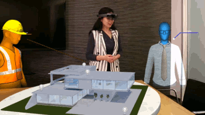
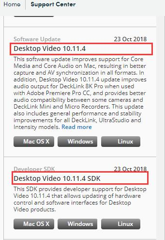

# 基于 Hololens 的第三人人称视角

当我们戴上 Hololens 时，一个没有戴上它的人是无法体验到我们所能体验到的奇迹。 SpectatorView（三方视角）允许其他人通过2D屏幕看到 Hololens 用户在他们的世界里看到的东西。

可以通过下面这个演讲视频来体验下三方视角的魅力：[A futuristic vision of the age of holograms](https://www.ted.com/talks/alex_kipman_the_dawn_of_the_age_of_holograms)

我将从 0 到 1 记录下三方视角实现的具体流程，所有使用到的程序、软件都在本项目中。旨在推广混合现实应用，帮助大家更轻松的实现三方视角。

## 一、实现流程概述

实现的具体步骤大致如下：

1. [软、硬件环境搭建](./EnvironmentSetup/README.md)
2. [Calibration](./Calibration/README.md)
3. [Compositor](./Compositor/README.md)
4. [运行示例程序](./SpectatorViewSample/README.md)

因为牵扯到多台 Hololens，因此为了避免歧义，规定：

- 与相机连接的 Hololens 称为：**三方视角提供者**
- 其他 Hololens 称为：**三方视角使用者**

## 二、软硬件需求

| 名称                             | 型号                                                         |
| -------------------------------- | ------------------------------------------------------------ |
| PC                               | Win10 PC【注意：务必1709 +】                                 |
| 开发环境                         | Visual Studio 2017 + Unity 2018.2.x                          |
| Hololens                         | Hololens * 2                                                 |
| 相机                             | Canon EOS 6D(W)，官方推荐[Canon EOS 5D Mark III](https://www.amazon.com/Canon-Frame-Full-HD-Digital-Camera/dp/B007FGYZFI/ref=sr_1_3?s=photo&ie=UTF8&qid=1480537693&sr=1-3&keywords=Canon+5D+Mark+III) |
| 视频采集卡                       | Blackmagic Design Intensity Pro 4K                           |
| Hololens Mount                   |                                                              |
| Hotshoe                          |                                                              |
| 线缆                             | MINI HDMI --> HDMI                                           |
| Blackmagic_DeckLink_SDK          |                                                              |
| Blackmagic_Desktop_Video_Windows |                                                              |
| OpenCV                           | [V 3.4.1-vc14_vc15](https://sourceforge.net/projects/opencvlibrary/files/opencv-win/3.4.1/opencv-3.4.1-vc14_vc15.exe/download) |

>我在百度网盘上上传了所有要用到的软件，方便大家下载：https://pan.baidu.com/s/1NOc_YMvCuC5wOaota1ujTA
>

注：Blackmagic 的两个软件官方没有说明使用哪个版本，只要保证版本对应即可，我使用的是 10.11.4 的版本，下载地址：[点击这里](https://www.blackmagicdesign.com/support/)。

## 三、参考资料

在三方视角实现过程中，参考了以下文章/视频，在此十分感谢！

- [MixedRealityCompanionKit](https://github.com/Microsoft/MixedRealityCompanionKit)
- [How to set up HoloLens Spectator View, Part 1 – 3D Printing, Tools and SDKs](https://www.andreasjakl.com/set-hololens-spectator-view-part-1/)
- [Spectator view——Hololens第三人称视角技术的详细实现过程](https://blog.csdn.net/frog_add1s/article/details/79569573)
- [Hololens第三人称视角Spectator View！](https://blog.csdn.net/lyx_zhl/article/details/56011636)
- [DataMesh MeshExpert Live! Hardware Assembly Guide - YouTube](https://www.youtube.com/watch?v=Yx6EKH_QjrU)
- [HoloLens Spectator View Bracket Assembly - YouTube](https://www.youtube.com/watch?v=PHF5TlyDg5M)

