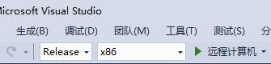
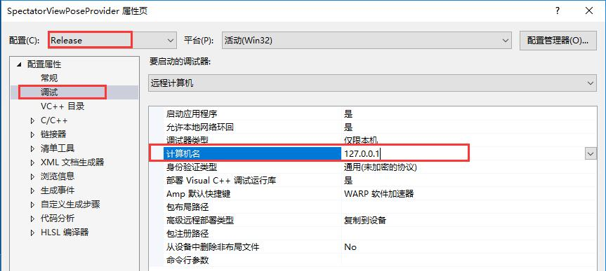
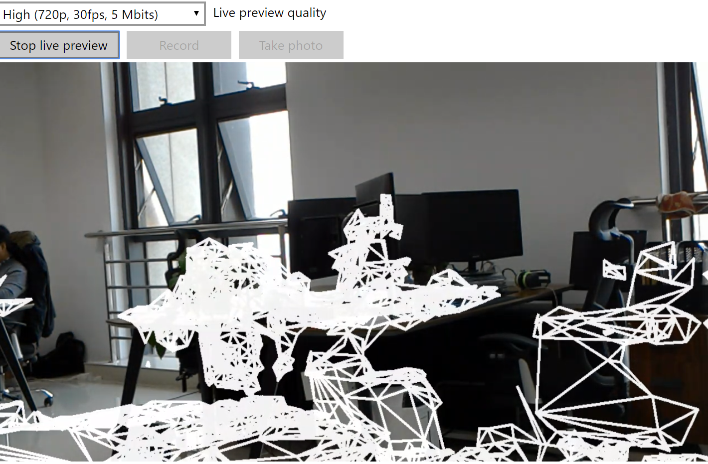

# 示例程序 ——提供者

> 因为牵扯到多台 Hololens，因此为了避免歧义，规定：
>
> - 与相机连接的 Hololens 称为：**三方视角提供者**
> - 其他 Hololens 称为：**三方视角使用者**

该程序用于为观众视图提供**姿态数据**和**空间映射信息**。程序启动并观察 10秒钟的空间映射数据，对其启动位置进行空间协作。

该程序会在一个已知的端口上监听所有连接的客户，一旦建立了连接，它会对客户端发送基于当前坐标系统的姿态数据。

---

打开 `SpectatorViewPoseProvider.sln`，调整为 Relase x86，远程计算机。

点击菜单栏：`调试 -> SpectatorViewPoseProvider -> Realease -> 调试`，计算机名设置为 127.0.0.1

使用 `Ctrl + F5`，将该项目部署到三方视角提供者上。部署成功后，通过 [Windows Device Portal](https://docs.microsoft.com/zh-cn/windows/mixed-reality/using-the-windows-device-portal) 看到画面类似于如下：

