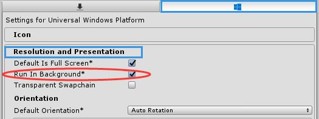
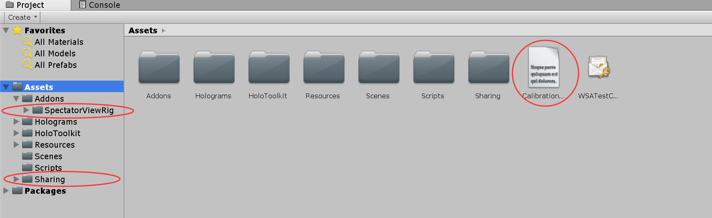

# 示例程序 ——使用者

>因为牵扯到多台 Hololens，因此为了避免歧义，规定：
>
>- 与相机连接的 Hololens 称为：**三方视角提供者**
>- 其他 Hololens 称为：**三方视角使用者**

## 零、启动提供者程序

[SpectatorViewPoseProvider](../SpectatorViewPoseProvider/README.md)

## 一、程序设置

> 这个程序中有一个简单的网络实现路由客户端对统一构成数据和游戏状态，它并没有把这些信息传回给所有有连接的客户端。如果你需要自定义网络，请参阅官方：[Network](https://github.com/Microsoft/MixedRealityCompanionKit/tree/master/SpectatorView/SpectatorViewSample#network)

1. 请将 Calibration 步骤中得到的 `CalibrationData.txt` 复制到 Assets 目录下。
2. 确认 Compositor 步骤中得到的 DLL 已经被复制到 Assets 目录下。

3. 点击菜单栏 `File-> Build Setting`，点击`Universal Windows Platform`平台，然后点击左下角的`Switch Platform`。

4. 点击菜单栏`Edit -> Project Settings -> Player`，选中`Windwos`图标选项卡，选中`XR Settings`，勾选`Virtual Reality Supported`。
5. 点击 Unity 菜单栏 `Edit->Project settings->Player`，切换到 Windwos 选项卡，选择 `Resolution and Presentation`，勾选 `Run in Background`。

## 二、运行程序

在 Hierarchy  中点击 SharingToSVAdapter ，在右侧设置中修改 `Server IP` 和 `Spectator View IP`：

> Server IP：PC的 IP 地址
>
> Spectator View IP：三方视角提供者的 IP 地址

点击菜单栏 `Spectaor View -> Compositor`调出输出窗口。

点击 `Windows->XR->Holographic Emulation`，远程连接三方视角使用者。连接成功后点击 Unity Play 按钮，在输出窗口中能够看见现实和立方体相混合，这就说明合成成功了！

## 三、 为任意程序添加 SpectorView 功能

1. 复制 *SpectatorViewSample/Assets/Addons/SpectatorViewRig* 到 Unity 程序的 *Assets/Addons* 目录下，确保包含 Compositor 步骤中生成的 DLL。
2. 复制 *SpectatorViewSample/Assets/Sharing* 到 Unity 程序的  *Assets* 目录下。
3. 复制 *CalibrationData.txt* 到 Unity 程序的 *Assets* 目录下。

拖拽 *Assets/Addons/SpectatorViewRig/Prefabs/SpectatorViewManager.prefabs* 到 Hierarchy 中，设置 `Spectator View Holo Lens IP`  为三方视角提供者的 IP。

拖拽 *Assets/Sharing/Sharing.prefabs* 到 Hierarchy 中，设置 `Server IP`  为 PC 的 IP。

点击菜单栏 `Spectaor View -> Compositor`调出输出窗口。

点击 `Windows->XR->Holographic Emulation`，远程连接三方视角使用者。连接成功后点击 Unity Play 按钮完成。

## 四、 Q & A

（1）为什么合成出来的图像和实际图像成镜像效果？

答：程序运行时三方视角使用者的朝向和三方视角提供者的朝向没有同向，这会导致提供者所建立的空间映射信息和使用者建立的空间映射信息相对，导致镜像。

（2）为什么我为自己的程序添加了 Spectator View 后，图像不能跟随 Hololens 眼镜的移动而移动？

答：安装 [MRTK 工具包](https://github.com/Microsoft/MixedRealityToolkit-Unity/releases/download/2017.4.2.0/HoloToolkit-Unity-2017.4.2.0.unitypackage)，使用其提供的 MixedRealityCamera 替代 MainCamera，安装教程参考文章：[Hololens开发笔记——MRTK](https://blog.csdn.net/yuanlaijike/article/details/84330011)。
